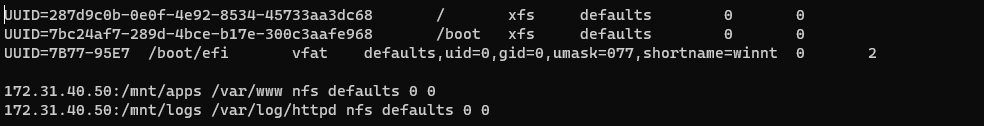

# Devops Website Solution
In the previous project (https://github.com/nwamsamson/PROJECT_6/blob/main/project6.md), I implemented a wordpress based solution that is ready to be filled with content and can be used as a full flesged website or blog. 

Moving further I will be adding some more value to my solutions that my Devops team could utilize. 

## Infrastructure setup and dependencies
1. Infrastruture: AWS
2. Webserver Linux: Red Hat Enterpeise Linux 9
3. Database Server: Ubuntu + MySQL
4. Programming Language: PHP
5. Code Repository: Github

## 3-Tier Web Application Architecture with a Single Database and an NFS Server as a shared files storage


On the diagram above we can see a common pattern where several stateless web servers share a common database and also access the same files using Network File System (NFS) as a shared file storage. Even though the NFS server might be located on a completely separate hardware- for web servers it look like a local file system from where they can serve the same files.


## PREPARE NFS SERVER

Launch an EC2 instance (Red Hat Enterprise Linux 9), which will be the NFS server. 

On this server, I attach 3 EBS 10GB volumes as external storage to the instance and create 3 logical volumes on it through which we will attach mounts from our external web servers. 

1. 3 logical volumes `lv-opt, lv-apps and lv-logs`
2. 3 mount directories `/mnt/opt, /mnt/apps and /mnt/logs`
3. Webserver content will be stored /apps, webserver logs in /logs and /opt will be used by jenkins in a later project


Steps taken to create the logical volumes can be seen in this project https://github.com/nwamsamson/PROJECT_6/blob/main/project6.md

Install NFS server, configure it to start on reboot using the following commands below:
`sudo yum -y update`
`sudo yum install nfs-utils -y`
`sudo systemctl start nfs-server.service`
`sudo systemctl enable nfs-server.service`
`sudo systemctl status nfs-server.service`


Set the mount point directory to allow read and write permissions to the webserver. we restart the NFS server `sudo systemctl restart nfs-server`


Configure access to NFS for clients within the same subnet. The subnet ID is found in the networking tab of our instances.


```
sudo vi /etc/exports

/mnt/apps <Subnet-CIDR>(rw,sync,no_all_squash,no_root_squash)
/mnt/logs <Subnet-CIDR>(rw,sync,no_all_squash,no_root_squash)
/mnt/opt <Subnet-CIDR>(rw,sync,no_all_squash,no_root_squash)

sudo exportfs -arv
```


Check which ports are in use by NFS and open it in the security groups `rpcinfo -p | grep nfs`

## Preparing Database Server
Create an Ubuntu Server on AWS which will serve as the database server.

MySQL server is installed and the tooling database is created, a database user 'webaccess' is created. 


### Preparing Web Servers

We have 3 webservers, so whatever is done on one will be done on the other 2.We need to make sure our webservers can serve the same content from shared storage solutions, in our case - NFS and MySQL database.
We already know that one DB can be accessed for reads and writes by multiple clients. For storing shared files that our webservers will use- we will utilize NFS and mount previously created logical volume `lv-apps` to the folder where Apache stores files to be served to the users (/var/www).
This approach will make the webservers stateless, which means we will be able to add new ones or remove them whenever we need, and the integrity of the data (in the database and on NFS) will be preserved. 

The following steps will be done to configure the webservers.
* Configure NFS client
* Deploy a Tooling application to our webservers into a shared NFS folder
* Configure the webserver to work with a single MySQL database

### configuration steps
Launch the webservers (EC2) with RHEL 9 Operating system, install the NFS client with the following code:
`sudo yum install nfs-utils nfs4-acl-tools -y`

Mount /var/www and target the NFS server's export for apps
```
sudo mkdir /var/www
sudo mount -t nfs -o rw,nosuid <NFS-Server-Private-IP-Address>:/mnt/apps /var/www

```
verify that NFS was mounted successfully by running `df -h` and to  make sure the changes will persist on the webserver after reboot we use the following commands `sudo vi /etc/fstab` and add the following line 

`<NFS-Server-Private-IP-Address>:/mnt/apps /var/www nfs defaults 0 0`




## Installing Apache and Php
```
sudo yum install httpd -y

sudo dnf install https://dl.fedoraproject.org/pub/epel/epel-release-latest-8.noarch.rpm

sudo dnf install dnf-utils http://rpms.remirepo.net/enterprise/remi-release-8.rpm

sudo dnf module reset php

sudo dnf module enable php:remi-7.4

sudo dnf install php php-opcache php-gd php-curl php-mysqlnd

sudo systemctl start php-fpm

sudo systemctl enable php-fpm

setsebool -P httpd_execmem 1

```
We can verify that both `/var/www and /mnt/apps` contains same content which shows that both mount points are connected via NFS


The git repository is cloned and the html folder in there is moved to the apache webserver folder.


Run <public_ip_address>/index.php on a web browser to access the site. Use public_ip_address of the web server


In the `/var/www/html` directory, edit the already written php script to connect to the database `sudo vi /var/www/html/functions.php`


Login into the application on the browser `<public_ip_address>/login.php


